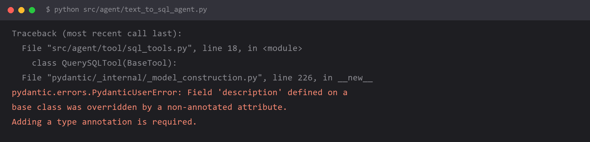

# LLM 应用开发踩坑手册

> 你在深夜遇到的那些报错，这里可能都记着。

**Java 后端接大模型**时踩过的坑，**按报错关键词索引，不按学习顺序**。

主攻 **Spring AI / LangChain4j / Spring Boot 3**，与 [hello-ai-backend](https://github.com/pgy763/hello-ai-backend)（写给 Java 后端工程师的 AI 接入手册）配套。也收录 LangChain（Python）的坑 —— 那是更早期踩下的，依然有效。

不用从头读 —— 把报错信息复制进来，`Ctrl+F` 搜一下就行。

*带报错截图是这里的惯例 —— 扫一眼就能确认是不是同一个问题。上面这张是早期 LangChain 条目的；Java 条目正在补图。*

---

## 这个仓库和别处有什么不同

大部分教程教你「怎么写对」，这里只记「怎么写错、以及为什么错」。

| | |
| --- | --- |
| **Java 优先** | 市面上的 AI 踩坑几乎全是 Python 的。这里优先记录 Java 生态（Spring AI / LangChain4j / Spring Boot 3）的问题 |
| **按报错索引** | 你手上只有报错，没有章节号。所以文件名就是症状，索引表就是搜索入口 |
| **四段固定结构** | 报错原文 / 为什么 / 怎么改 / 怎么预防。看完知道怎么修，也知道下次怎么躲 |
| **标了环境版本** | 大部分坑的根因是版本差异。不标版本的坑等于没写 |
| **配报错截图** | 不用读文字，扫一眼截图就知道是不是同一个错。早期 24 条全配了，Java 的 6 条正在补 |

## 怎么用

1. 把报错信息复制进来，`Ctrl+F` 搜**最独特的那个词**
   （Java 的坑搜 `UnsupportedClassVersionError`、`NoSuchMethodError`、`No converter for`；
   Python 的坑搜 `PydanticUserError`、`context_length_exceeded`、`0x80`。别搜 `error`）
2. 找到对应文件，看「为什么」和「怎么改」
3. 搜不到？[开个 Issue](https://github.com/pgy763/llm-dev-pitfalls/issues) 把报错贴上来，我来补

---

## 索引

共 **30 条**：Java 生态 6 条（持续补充），其余 24 条是早期 LangChain / Python 阶段踩下的。

### Java 与框架集成 `docs/java` · 6 条 🔥 当前主攻

| 报错关键词 | 一句话原因 | 文件 |
| --- | --- | --- |
| `UnsupportedClassVersionError: class file version 61.0` | 编译用 JDK 17，运行用 JDK 8 | [看 →](docs/java/JDK版本不匹配.md) |
| `No converter for [class reactor.core.publisher.FluxJust]` | MVC 项目里返回了 `Flux`，MVC 不认识它 | [看 →](docs/java/MVC项目返回Flux报错.md) |
| `NoSuchMethodError: dev.langchain4j...` | LangChain4j 多个模块版本不一致 | [看 →](docs/java/LangChain4j模块版本不对齐.md) |
| `UnrecognizedPropertyException: Unrecognized field` | 厂商多返回了字段，DTO 没忽略未知字段 | [看 →](docs/java/Jackson反序列化未知字段.md) |
| 流式回答说到一半就断（不报错） | 给流式请求设了「总时长」超时 | [看 →](docs/java/流式请求设了总超时.md) |
| `InvalidDefinitionException: Java 8 date/time type ...` | 自己 `new` 的 `ObjectMapper` 没注册 `JavaTimeModule` | [看 →](docs/java/自定义ObjectMapper不认时间类型.md) |

### 密钥与鉴权 `docs/auth` · 5 条

| 报错关键词 | 一句话原因 | 文件 |
| --- | --- | --- |
| `The api_key client option must be set` | `.env` 没加载，或工作目录不对 | [看 →](docs/auth/没读到api-key.md) |
| `401 Authentication Fails` | key、URL、客户端、模型名四件套不是同一家 | [看 →](docs/auth/401密钥串台.md) |
| `503 分组 default 下无可用渠道` | 中转站的分组里没有这个模型的渠道 | [看 →](docs/auth/中转站没有可用渠道.md) |
| `429 Rate limit reached` | 循环调用超过套餐 RPM / TPM 上限 | [看 →](docs/auth/429限流.md) |
| 🔴 `git log -S "sk-"` 有输出 | 密钥进了 git 历史，删掉当前代码也没用 | [看 →](docs/auth/密钥提交进了git历史.md) |

### 接口与模型 `docs/endpoint` · 4 条

| 报错关键词 | 一句话原因 | 文件 |
| --- | --- | --- |
| `404 Not Found` | `base_url` 多写了 `/chat/completions`，SDK 会自己拼 | [看 →](docs/endpoint/base-url多写了路径.md) |
| `model_not_found` | 模型名少了版本后缀，或该账号无权限 | [看 →](docs/endpoint/模型名不存在.md) |
| `maximum context length is xxx tokens` | 对话历史不裁剪，或 RAG 检索结果塞太多 | [看 →](docs/endpoint/上下文超长.md) |
| 请求卡住 600 秒才超时 | SDK 默认超时太长，用户干等十分钟 | [看 →](docs/endpoint/请求挂死超时太长.md) |

### 环境与编码 `docs/env` · 5 条

| 报错关键词 | 一句话原因 | 文件 |
| --- | --- | --- |
| `'gbk' codec can't decode byte` | Windows 下 Python 默认 GBK，读不了 UTF-8 的 `.env` | [看 →](docs/env/Windows下gbk编码报错.md) |
| `invalid literal for int(): (3306,)` | 赋值行多了个尾逗号，值变成了元组 | [看 →](docs/env/多写一个逗号变成元组.md) |
| `unexpected keyword argument 'charset '` | 连接串里参数名带了空格 | [看 →](docs/env/URL参数不能有空格.md) |
| 流式输出中文变 `锟斤拷` | 终端或 Python 输出编码不是 UTF-8 | [看 →](docs/env/流式输出中文乱码.md) |
| `Chroma requires sqlite3 >= 3.35.0` | Python 内置 sqlite 太旧，跟系统装的那个无关 | [看 →](docs/env/Chroma需要新版sqlite.md) |

### Python 与类型 `docs/python` · 5 条（早期条目，不再新增）

| 报错关键词 | 一句话原因 | 文件 |
| --- | --- | --- |
| `PydanticUserError: ... non-annotated attribute` | pydantic v2 要求覆盖基类字段必须写类型注解 | [看 →](docs/python/pydantic-v2必须写类型注解.md) |
| `string indices must be integers` | 把 `list[str]` 当成 `list[dict]` 用了 | [看 →](docs/python/把返回的列表当字典用.md) |
| `AttributeError: ... Did you mean` | 拼写错误，报错信息里已经给了正确写法 | [看 →](docs/python/属性名拼写错误.md) |
| `No module named 'my_llm'` | `langgraph dev` 走包路径加载，裸导入失效 | [看 →](docs/python/langgraph下模块导入失败.md) |
| `OutputParserException: Could not parse` | 模型给 JSON 包了代码块和客套话 | [看 →](docs/python/结构化输出解析失败.md) |

### Agent 与工具 `docs/agent` · 3 条

| 报错关键词 | 一句话原因 | 文件 |
| --- | --- | --- |
| `Agent stopped due to iteration limit` | 工具描述不清，模型反复调同一个工具 | [看 →](docs/agent/Agent陷入无限循环.md) |
| 工具定义了但模型不调用 | `description` 只写了功能名，没写什么时候用 | [看 →](docs/agent/工具描述太模糊模型不调用.md) |
| 检查通过但执行报语法错 | 纯关键字校验没验语法，要加 `EXPLAIN` 干跑 | [看 →](docs/agent/SQL检查工具查不出语法错误.md) |

### RAG 与检索 `docs/rag` · 2 条

| 报错关键词 | 一句话原因 | 文件 |
| --- | --- | --- |
| `Embedding dimension xxx does not match` | 中途换了 embedding 模型，维度对不上 | [看 →](docs/rag/向量维度不匹配.md) |
| 回答和问题无关（不报错） | 切片把答案切碎了，检索根本没命中 | [看 →](docs/rag/切分不当导致答非所问.md) |

---

## 按「症状」找

不知道报错叫什么，只知道现象？从这儿进：

| 现象 | 大概率是 |
| --- | --- |
| 报错里出现 `class file version` | JDK 版本不一致 → [JDK版本不匹配](docs/java/JDK版本不匹配.md) |
| 报错里出现 `No converter for` / `FluxJust` | MVC 里返回了 `Flux` → [MVC项目返回Flux报错](docs/java/MVC项目返回Flux报错.md) |
| 报错里出现 `NoSuchMethodError` | 依赖版本冲突 → [LangChain4j模块版本不对齐](docs/java/LangChain4j模块版本不对齐.md) |
| 报错里出现 `Unrecognized field` | 厂商字段差异 → [Jackson反序列化未知字段](docs/java/Jackson反序列化未知字段.md) |
| 报错里出现 `Java 8 date/time type` / `jsr310` | 你用的不是 Spring 那个 `ObjectMapper` → [自定义ObjectMapper不认时间类型](docs/java/自定义ObjectMapper不认时间类型.md) |
| `LocalDateTime` 被序列化成数组 `[2026,9,30,...]` | `WRITE_DATES_AS_TIMESTAMPS` 没关 → [自定义ObjectMapper不认时间类型](docs/java/自定义ObjectMapper不认时间类型.md) |
| 回答说到一半就断、还不报错 | 流式总超时 → [流式请求设了总超时](docs/java/流式请求设了总超时.md) |
| 报错里出现 `401` / `403` | 密钥或鉴权 → `docs/auth` |
| 报错里出现 `404` | `base_url` 或模型名 → `docs/endpoint` |
| 报错里出现 `429` | 限流 → [429限流](docs/auth/429限流.md) |
| 报错里出现 `503` | 上游或中转站的问题 → [中转站没有可用渠道](docs/auth/中转站没有可用渠道.md) |
| 报错里出现 `gbk` | Windows 编码 → `docs/env` |
| 报错里出现 `pydantic` | v1/v2 版本差异 → `docs/python` |
| 程序卡住不动、不报错 | 超时设置 → [请求挂死超时太长](docs/endpoint/请求挂死超时太长.md) |
| 不报错，但答案不对 | 检索问题 → `docs/rag` |
| 模型不调用你写的工具，或者反复调同一个 | 工具 `description` 没写清「什么时候用」 → [工具描述太模糊模型不调用](docs/agent/工具描述太模糊模型不调用.md) |
| 模型返回的内容解析不出来 | 输出格式没约束住 → [结构化输出解析失败](docs/python/结构化输出解析失败.md) |
| 中文变乱码 | 编码 → [流式输出中文乱码](docs/env/流式输出中文乱码.md) |

---

## 环境对照

**Java 侧**（新增条目主要在这套环境下复现）：

| 组件 | 版本 |
| --- | --- |
| JDK | 17 / 21 |
| Spring Boot | 3.x |
| Spring AI | 1.x |
| LangChain4j | 1.x |
| 构建工具 | Maven 3.9+ |
| 用的模型 | DeepSeek / 阿里云百炼 qwen 系列 |

**Python 侧**（早期条目）：

| 组件 | 版本 |
| --- | --- |
| Python | 3.13 |
| langchain / langchain-core | 1.x |
| pydantic | v2 |
| chromadb | 0.5.x |

> 两侧相同的环境：Windows 11（中文版）。
> Spring AI 与 LangChain4j 都还在快速迭代，版本号以官方最新文档为准 —— 这里只标大版本。
> **同样的坑在不同版本上表现可能不同。** 如果你在别的版本上遇到不一样的报错，欢迎开 Issue 补充 —— 加一条就是加一条。

## 路线图

- [x] LangChain（Python）实战踩坑 —— 24 条
- [x] **转向 Java 生态**（Spring AI / LangChain4j / Spring Boot 3）—— 6 条
- [ ] Java 条目扩到 20 条 —— 当前 **6 / 20**，按「接口调用 / 流式 / 依赖 / 部署」分类整理
- [ ] 每条坑补「最小复现代码」
- [ ] 给新增的 Java 条目补报错截图（现有 Java 条目都还没配图）
- [ ] 配套项目：[hello-ai-backend](https://github.com/pgy763/hello-ai-backend) —— 写给 Java 后端工程师的 AI 接入手册

## 贡献

见 [CONTRIBUTING.md](CONTRIBUTING.md)。

**最省事的方式**：提一个 [Issue](https://github.com/pgy763/llm-dev-pitfalls/issues)，把你遇到的报错原文和解决过程贴上来就行，格式我来整理。
你的报错原文本身就有价值 —— 因为别人会搜同一句话。

## License

[MIT](LICENSE)
