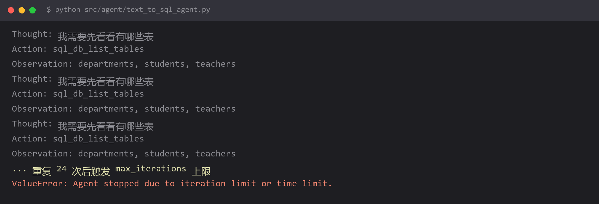

# Agent 陷入无限循环，烧光 token 也拿不到答案



## 现象

```
Thought: 我需要先看看有哪些表
Action: sql_db_list_tables
Observation: departments, students, teachers
Thought: 我需要先看看有哪些表
Action: sql_db_list_tables
Observation: departments, students, teachers
Thought: 我需要先看看有哪些表
Action: sql_db_list_tables
Observation: departments, students, teachers
... 重复 24 次后触发 max_iterations 上限
ValueError: Agent stopped due to iteration limit or time limit.
```

同一句话说了 25 遍，什么都查不出来，**但每一次循环都是真实的 API 调用，都在计费**。

## 为什么

Agent 的循环是：**思考 → 选工具 → 得到结果 → 再思考**。它判断"任务完成了吗"的唯一依据，是模型看自己有没有输出 `Final Answer`。

模型不输出 Final Answer 就会有四个原因，对应四类修法：

| 原因 | 表现 | 本质 |
| --- | --- | --- |
| **工具描述太模糊** | 反复调同一个工具 | 模型不知道还能调什么 |
| **工具返回值没有信息量** | 调完还是不推进 | 模型拿不到决策所需的信息 |
| **系统提示词没定义终止条件** | 一直在"探索" | 模型不知道什么算完成 |
| **任务本身超出了模型能力** | 绕圈子后放弃 | 提示词再改也没用 |

第一条循环的原因就很典型：`sql_db_list_tables` 返回了表名，模型需要**再调 `sql_db_schema` 看结构**才能写 SQL。但它没调——说明它不知道还有 `sql_db_schema` 这个工具，或者不确定该什么时候用。

## 怎么改

**第一层：设置硬上限（必须做，防的是烧钱）**

```python
from langchain.agents import AgentExecutor

executor = AgentExecutor(
    agent=agent,
    tools=tools,
    max_iterations=6,              # 硬上限，达到就停
    max_execution_time=60,         # 总时长上限（秒）
    early_stopping_method="generate",   # 到上限时让模型用已有信息给个答案
    handle_parsing_errors=True,    # 解析错也别炸，把错误喂回给模型
    return_intermediate_steps=True,# 保留轨迹，方便排查
)
```

`early_stopping_method` 这个参数很关键：

| 取值 | 达到上限时的行为 |
| --- | --- |
| `"force"` | 直接返回 "Agent stopped due to iteration limit" |
| `"generate"` | **让模型用已收集的信息生成最终答案** |

选 `generate` 至少能给用户一个不完整但有内容的回答，比报错好得多。

**第二层：把工具描述写清楚（治本）**

这是最有效的一招。看看两种写法的区别：

```python
# 差：模型不知道该不该用、什么时候用
class SchemaTool(BaseTool):
    name: str = "schema"
    description: str = "查询表结构"

# 好：说清「做什么、什么时候用、输入什么、返回什么」
class SchemaTool(BaseTool):
    name: str = "sql_db_schema"
    description: str = (
        "查询指定表的完整结构，包括字段名、类型、注释、主键和外键。\n"
        "使用时机：在写 SQL 之前，必须先调用本工具确认字段名和类型。\n"
        "输入：表名，多个表用英文逗号分隔，例如 'students,departments'。\n"
        "返回：每个表的字段列表与外键关系。\n"
        "注意：表名必须是 sql_db_list_tables 返回过的名字，不要臆造。"
    )
```

最后那句"注意"尤其有用——它直接堵住了"模型自己编表名"的路径。

**第三层：在系统提示词里明确流程和终止条件**

```python
SYSTEM_PROMPT = """
你是一个数据库查询助手。必须严格按以下步骤执行，不允许跳步：

1. 调用 sql_db_list_tables，确认有哪些表
2. 调用 sql_db_schema，查看相关表的结构
3. 写一条 SQL
4. 调用 sql_db_check 验证 SQL
5. 调用 sql_db_query 执行
6. 输出最终答案

终止条件：当你已经拿到查询结果，立即输出最终答案，
不要再调用任何工具。答案必须基于查询结果，不要编造数据。

限制：整个过程最多调用 6 次工具。如果 6 次内无法完成，
直接说明你目前掌握了什么、还缺什么。
"""
```

**明确写出"最多调用 N 次"和"什么情况下停下来"**，比只说"按步骤来"有效得多。

**第四层：让工具返回值更有信息量**

```python
# 差：返回一个裸列表
def _run(self):
    return str(self.db_manager.get_table_names())
    # → "['departments', 'students', 'teachers']"

# 好：给出上下文和下一步指引
def _run(self):
    names = self.db_manager.get_table_names()
    return (
        f"数据库共有 {len(names)} 张表：{', '.join(names)}\n"
        f"下一步：用 sql_db_schema 查看你需要的表的结构"
    )
```

**工具返回值是给模型看的，不是给程序解析的**——带上"下一步该干什么"的提示，能显著减少无效循环。

## 怎么预防

**开发期一定要能看见完整轨迹**，否则你根本不知道它在绕圈：

```python
for step in agent.stream({"messages": [...]}, stream_mode="values"):
    step["messages"][-1].pretty_print()
```

看到 `Action` 重复出现同一个工具名，就是循环了。

三条规则：

1. **`max_iterations` 必须设**。默认值通常很大（或无穷），一旦循环就是一整夜的账单。**这条不是为了跑得对，是为了不会烧到破产。**
2. **工具描述要写"使用时机"，不只是"功能"。** 模型选工具靠的是描述，不是代码。
3. **循环次数应该做成可观测指标**，跑一段时间看平均迭代次数。如果平均 5 次但上限是 6，说明整个流程都在临界点上，迟早出问题。

**一个反直觉的结论**：Agent 循环往往不是"模型太笨"，而是**工具设计得不够好**。多做一次"把工具描述当作产品文档来写"的功夫，比换更贵的模型见效更快。

## 环境

| 组件 | 版本 |
| --- | --- |
| Python | 3.13 |
| langchain | 1.x |
| 复现条件 | 多工具 Agent 且未设 max_iterations |
