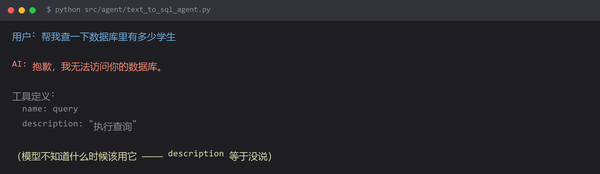

# 工具明明定义了，模型却不调用



## 现象

```
用户: 帮我查一下数据库里有多少学生

AI: 抱歉，我无法访问你的数据库，建议你直接在数据库客户端执行查询。
```

后端日志里**一次工具调用记录都没有**。工具定义得好好的，模型就是不用。

## 为什么

**模型选不选某个工具，唯一的依据是 `description` 这段文字。** 它看不到你的函数签名、看不出参数类型（除非写在描述里）、更不会去读你的实现。

所以 `description="执行查询"` 这种写法，等于告诉模型：

> 这儿有个东西，功能不明，什么时候用不明，你自己看着办。

模型看着办的结果就是不办——**它宁可回答"我做不到"，也不会乱调一个它看不懂的工具**。这是训练带来的保守性，是好事。

**判断链**：模型要调用一个工具，需要同时确认三件事。任何一件它答不上来，就不会调。

| 要确认的 | 靠什么知道 |
| --- | --- |
| 这个工具能解决我现在的问题吗 | `description` 里说清"干什么" |
| 现在该用它，还是先干别的 | `description` 里说清"什么时候用" |
| 我该传什么进去 | 参数说明 + `description` 里说清格式 |

## 怎么改

**核心：把 description 当产品文档写，不是当注释写。**

对照一下：

```python
# 差 —— 三个问题一个都没回答
class StudentCountTool(BaseTool):
    name: str = "query"
    description: str = "执行查询"

# 好
class StudentCountTool(BaseTool):
    name: str = "count_students"
    description: str = (
        "统计数据库中符合条件的学生人数。\n"
        "使用时机：当用户询问'有多少学生''人数''个数'这类数量问题时使用。\n"
        "输入：可选的筛选条件，如院系名 '计算机系'；不传则统计全部学生。\n"
        "返回：一个整数和对应的中文说明。\n"
        "示例：用户问'计算机系有多少人' → 调用本工具，参数 dept='计算机系'。"
    )
```

差别在于六个要素：

| 要素 | 作用 |
| --- | --- |
| **做什么** | 让模型判断"这能不能解决我的问题" |
| **什么时候用** | 最关键的一条。用用户会说的话来描述场景 |
| **什么时候不用** | 防止误用，尤其是有多个相似工具时 |
| **输入格式** | 具体到能照着填，别写"表名"要写"英文逗号分隔的表名列表" |
| **返回什么** | 让模型知道拿到结果后怎么用 |
| **一个示例** | 最省事、效果最明显的一条 |

**最后那个"示例"优先级最高。** 如果只能改一处，就加示例：

```python
description: str = (
    "查询指定学生的成绩。\n"
    "示例：用户问「张三考了多少分」→ 调用本工具，参数 name='张三'。"
)
```

一句话就能把调用率拉上去，因为它把"用户的说法"和"工具的调用"直接映射起来了。

**几个容易忽略的坑：**

**1. 有多个相似工具时，必须互相排除**

```python
# 两个工具描述都写"查询学生信息"，模型就会随机选
# 要明确划界：
class BasicInfoTool(BaseTool):
    description: str = (
        "查询学生的基本信息（姓名、学号、班级、院系）。\n"
        "不用于查询成绩 —— 查成绩请用 student_score 工具。"
    )

class ScoreTool(BaseTool):
    description: str = (
        "查询学生的课程成绩。\n"
        "不用于查询基本信息 —— 查基本信息请用 student_basic_info 工具。"
    )
```

**2. 参数要写类型和约束**

```python
# 错：模型可能传 "3个" 或 "三"
top_k: int = Field(default=5, description="返回条数")

# 对
top_k: int = Field(
    default=5,
    description="返回的最大条数，必须是 1 到 50 之间的整数，默认 5"
)
```

**3. 工具名本身也是提示**

| 工具名 | 模型理解 |
| --- | --- |
| `query` | ？？？ |
| `tool1` | ？？？ |
| `sql_db_list_tables` | 列出数据库的表 |
| `count_students` | 统计学生人数 |

**命名用 `动词_对象` 的结构，自解释。**

## 怎么预防

**写完工具后，做一次"盲测"**：

> 把工具的 `name` 和 `description` 单独截图，发给一个不了解这个项目的人（或者换个没上下文的对话问模型），让他判断"用户说某某需求时该不该用这个工具"。

**如果他答不上来，模型也答不上来。**

三条规则：

1. **每个工具的 description 都要能独立回答"什么时候用"**，不依赖其他工具的上下文
2. **有相似工具时，必须在描述里写明彼此的分工和边界**
3. **加示例**。示例是性价比最高的一行文字

**反向排查技巧**：如果模型该调的时候不调，先别改提示词，去把 `description` 单独拎出来读一遍——

**假装你只是个读过这段话的人，你能知道什么时候该用它吗？** 答不上来就是描述的问题，不是模型的问题。

## 环境

| 组件 | 版本 |
| --- | --- |
| Python | 3.13 |
| langchain-core | 1.x |
| 复现条件 | 工具 description 只写功能名，不写使用场景 |
