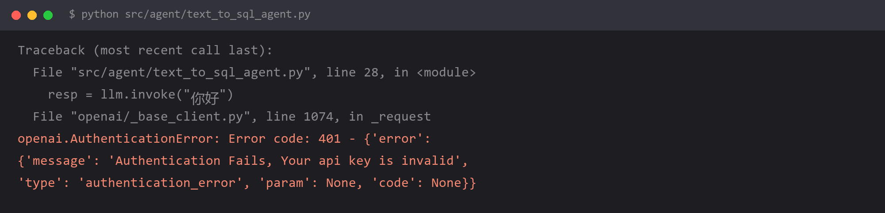

# `401 Authentication Fails`（key 和 URL 不是同一家）



## 报错

```
openai.AuthenticationError: Error code: 401 -
{'error': {'message': 'Authentication Fails, Your api key is invalid',
           'type': 'authentication_error', 'code': 'invalid_request_error'}}
```

key 是从控制台复制来的，确认没多空格，但就是 401。

## 为什么

**key、base_url、客户端类、模型名，这四个必须来自同一家。**

最常见的错配是：用阿里云百炼的 key，配了 DeepSeek 的 `base_url`。两边都各自「认识」自己的 key，互相不认。

这个错在多个 provider 并存的项目里几乎必踩一次，因为你会复制上一个 provider 的代码块来改——很容易漏改其中一项。

四件套对照：

| 提供方 | base_url | 客户端类 | 模型名示例 |
| --- | --- | --- | --- |
| 阿里云百炼 | `https://dashscope.aliyuncs.com/compatible-mode/v1` | `ChatOpenAI` | `qwen-plus` |
| 深度求索 DeepSeek | `https://api.deepseek.com/v1` | `ChatOpenAI` 或 `ChatDeepSeek` | `deepseek-chat` |
| 智谱 | `https://open.bigmodel.cn/api/paas/v4` | `ChatOpenAI` 或 `ChatZhipuAI` | `glm-4-plus` |
| 各类中转站 | 各站自己的地址 | `ChatOpenAI` | 各站支持的模型 |

注意前三个都能用 `ChatOpenAI`，因为它们都兼容 OpenAI 协议——**这正是最容易串台的地方**：代码长得一模一样，只有 `base_url` 和 key 不同。

## 怎么改

把配置按 provider 分组，不要平铺：

```python
import os
from dotenv import load_dotenv
from langchain_openai import ChatOpenAI

load_dotenv()

PROVIDERS = {
    "qwen": {
        "api_key": os.getenv("DASHSCOPE_API_KEY"),
        "base_url": "https://dashscope.aliyuncs.com/compatible-mode/v1",
        "model": "qwen-plus",
    },
    "deepseek": {
        "api_key": os.getenv("DEEPSEEK_API_KEY"),
        "base_url": "https://api.deepseek.com/v1",
        "model": "deepseek-chat",
    },
}

def build_llm(name: str) -> ChatOpenAI:
    cfg = PROVIDERS[name]
    return ChatOpenAI(**cfg)
```

更进一步：**环境变量名带上提供方前缀**（`DASHSCOPE_API_KEY` 而不是 `API_KEY`）。这样别人看代码就知道这个 key 属于谁，也不会出现「同一个 `API_KEY` 变量被三家抢」。

想先验证再写代码，用一行 curl 探活最快：

```bash
curl https://api.deepseek.com/v1/models \
     -H "Authorization: Bearer $DEEPSEEK_API_KEY"
```

这把 key 和 URL 单独拎出来试，能立刻排除代码的问题。不返 401 就说明配置对，问题在代码；返 401 就说明配置错，问题在 key 或 URL。

## 怎么预防

**看到 401 不要改代码，先怀疑配置四件套。**

判断口诀：401 是「你是谁我不知道」，说明**鉴权根本没通过**，请求压根没到业务逻辑。所以排查范围可以完全锁定在 URL / key / 提供方这三样上，跟 prompt、模型参数、代码逻辑都没关系。

## 环境

| 组件 | 版本 |
| --- | --- |
| Python | 3.13 |
| langchain-openai | 1.x |
| 涉及提供方 | 阿里云百炼 / DeepSeek / 智谱 |
