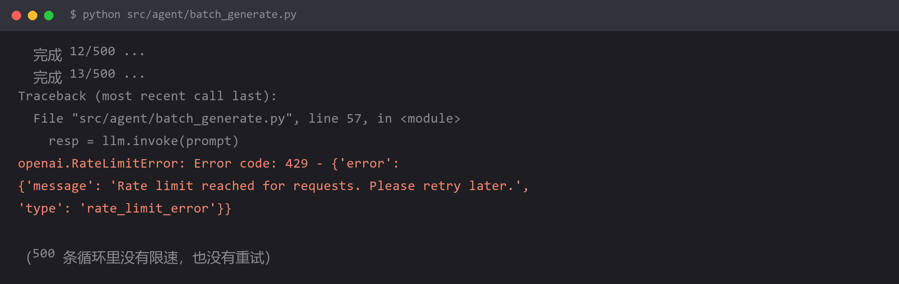

# `429 Rate limit reached` —— 批量调用被限流



## 报错

```
openai.RateLimitError: Error code: 429 - {'error':
{'message': 'Rate limit reached for requests. Please retry later.',
'type': 'rate_limit_error'}}
```

本地单测全过，一跑批量任务（几百上千条）就在中途炸掉。

## 为什么

模型厂商对 API Key 有**速率限制**，通常两个维度同时限制：

| 维度 | 含义 | 典型值 |
| --- | --- | --- |
| RPM | 每分钟请求数 | 60 / 500 / 3000 |
| TPM | 每分钟 token 数 | 100000 / 1000000 |

你的循环以最大速度发请求，很快就把 RPM 打满。**单测之所以不炸，是因为它只发一两次请求**——这是这个坑最迷惑人的地方：**测试环境永远复现不出来**。

还有一层：限流是**按 Key 按分钟**计的，不是按总量。所以：

- 第 1 秒发 60 个请求 → 立刻 429
- 就算后面 59 秒什么都不干，这一分钟也已经废了

## 怎么改

**第一层：加指数退避重试**

```python
import time
from openai import RateLimitError

def call_with_retry(fn, *args, max_retries=5, **kwargs):
    for attempt in range(max_retries):
        try:
            return fn(*args, **kwargs)
        except RateLimitError:
            if attempt == max_retries - 1:
                raise
            wait = 2 ** attempt          # 1, 2, 4, 8, 16 秒
            print(f"被限流，{wait} 秒后重试（第 {attempt + 1} 次）")
            time.sleep(wait)
```

其实 LangChain 的 Runnable 自带这个能力，不用自己写：

```python
from langchain_core.runnables import RunnableLambda

chain = chain.with_retry(
    retry_if_exception_type=(RateLimitError,),
    stop_after_attempt=5,
    wait_exponential_jitter=True,   # 指数退避 + 随机抖动
)
```

**抖动能避免"多个 worker 同时重试"引起的二次冲撞。**

**第二层：控制并发和速率**

```python
from concurrent.futures import ThreadPoolExecutor
import threading, time

class RateLimiter:
    """最简单的令牌桶：每秒最多放行 rate 个请求"""
    def __init__(self, rate: float):
        self.rate = rate
        self.interval = 1.0 / rate
        self.lock = threading.Lock()
        self.next_time = time.monotonic()

    def acquire(self):
        with self.lock:
            now = time.monotonic()
            if now < self.next_time:
                time.sleep(self.next_time - now)
            self.next_time = max(now, self.next_time) + self.interval

limiter = RateLimiter(rate=5)      # 每秒 5 个

def task(prompt):
    limiter.acquire()
    return llm.invoke(prompt)

with ThreadPoolExecutor(max_workers=8) as pool:
    results = list(pool.map(task, prompts))
```

注意：`max_workers` 和 `rate` 要匹配。workers 再多也没用——瓶颈在 limiter。

**第三层：批量任务拆成断点可续的作业**

```python
import json, os

done = set()
if os.path.exists("progress.json"):
    done = set(json.load(open("progress.json")))

for i, item in enumerate(items):
    if i in done:
        continue
    result = task(item)
    save_result(i, result)
    done.add(i)
    if i % 20 == 0:                          # 定期落盘，别等全部跑完
        json.dump(sorted(done), open("progress.json", "w"))
```

被限流整段中断后，重跑会跳过已完成的，不用从头烧一遍钱。

## 怎么预防

**看到 429 不要当成"偶发错误"，它是设计信号：你的调用速率超过了套餐允许的上限。**

三条规则：

1. **凡是循环调模型，默认都要有速率控制**，不要依赖"应该不会那么快"
2. **重试必须带退避**，不能写成 `while True: sleep(0.1)`——那是把限流变成拒绝服务
3. **批量任务的进度要落盘**，否则第 800 条被限流，前面的 799 条全白跑

还有一个判断技巧，帮你区分两种"限流"：

| 现象 | 含义 | 对策 |
| --- | --- | --- |
| 突然开始 429，持续一整分钟 | 触发了 RPM/TPM 上限 | 降速 + 重试 |
| 一直 429，重试也没用 | 额度用完了 / 账户欠费 | 去控制台看余额 |

**第二种重试一万次也没用**，先查余额再说。

## 环境

| 组件 | 版本 |
| --- | --- |
| Python | 3.13 |
| openai | 1.x |
| 复现条件 | 循环调用超过套餐 RPM 或 TPM |
