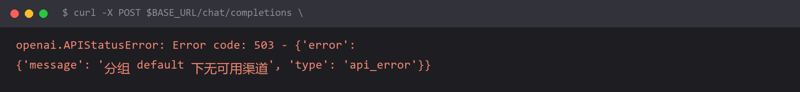

# `503 分组 default 下无可用渠道`（中转站的坑）



## 报错

```
openai.APIStatusError: Error code: 503 -
{'error': {'message': '分组 default 下无可用渠道', 'type': 'api_error'}}
```

用的第三方中转站，钱也充了，key 也没错，但一直 503。

## 为什么

「渠道」是**中转站的术语**，指的是它上游对接的真实模型供应方。

中转站的运作方式是：它把上游各家（官方 API、其他中转）接成一个个「渠道」，按**分组**管理。你的 key 属于某个分组，请求进来时它只在这个分组里找能服务该模型的渠道。

所以「分组 default 下无可用渠道」翻译成人话是：**你所在的这个分组，没有任何一个渠道能提供你请求的那个模型。**

四种原因：

1. 你请求的模型名，这个分组根本没配
2. 有配，但上游渠道刚好全挂了
3. 有配，但你的分组权限不够（站方按付费档位分配模型）
4. 模型名写的是官方名，但中转站用的是自己的别名

**这跟你的代码没关系**，是站方的配置问题或你的套餐问题。

## 怎么改

**第一步：确认这个中转站支持哪些模型。**

访问 `{base_url}/models` 列出它实际提供的模型：

```bash
curl https://你的中转站域名/v1/models \
     -H "Authorization: Bearer 你的中转站key" | python -m json.tool
```

拿返回的模型名和你 `ChatOpenAI(model=...)` 里写的对比。**这一步能解决 80% 的 503**——通常是模型名对不上。

**第二步：如果模型名没问题，就是分组权限。** 去中转站控制台：

- 看「令牌/分组」页面，确认当前 key 属于哪个分组
- 看「渠道」页面，确认目标模型挂在哪个分组
- 两者不一致就调整其中之一（通常是在创建令牌时选对分组）

**第三步：如果都对，就是上游临时不可用。** 换个模型试一次，能通就说明是这个模型的渠道挂了，找站方客服。

## 怎么预防

**中转站不是官方 API，它的可用性和模型列表是站方随时可以改的。** 所以：

1. **接入前先跑 `curl /v1/models`**，确认你要的模型在列表里、且在你的分组内——比写完代码再排查快得多
2. **模型名不要写死在代码里**，放 `.env`，站方改动时改配置不改代码
3. **生产环境不要只接一家中转站**，配置降级链（主用官方 API，备用中转站）

顺带一个判断技巧：

| 状态码 | 含义 | 该怀疑谁 |
| --- | --- | --- |
| 401 | 鉴权没过 | 你的 key / URL |
| 404 | 路径或模型不存在 | 你的 base_url / 模型名 |
| 429 | 被限流 | 你的调用频率 / 套餐额度 |
| **503** | **服务端说「我这没有」** | **站方的渠道配置 / 上游挂了** |

503 基本可以直接断定「不是我的代码问题」。

## 环境

| 组件 | 版本 |
| --- | --- |
| Python | 3.13 |
| langchain-openai | 1.x |
| 涉及提供方 | 第三方 API 中转站 |
