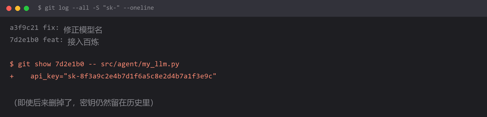

# 密钥提交进了 git 历史



## 现象

不是报错，是比报错更麻烦的事：

```bash
$ git log --all -S "sk-" --oneline
a3f9c21 fix: 修正模型名
7d2e1b0 feat: 接入百炼
```

密钥**曾经**出现在 `7d2e1b0` 里。你可能早就把它删了、改成了读环境变量、当前代码里干干净净——

**但历史还在。** 任何人 clone 你的仓库、跑一遍 `git log -p`，就能拿到那个 key。

## 为什么

`git commit` 记录的是**快照**，不是差分。每次提交都保存了当时的完整内容，历史记录**只增不减**。

所以「删掉密钥再提交一次」这个操作，只是在新版本里没有它了，旧版本里仍然原样保留。

GitHub 上尤其危险：

- 公开仓库的代码会被各种爬虫扫描（有专门的机器人盯 GitHub 找泄漏的 key）
- 有真实案例是密钥提交后**几分钟内**就被扫到并盗刷
- Fork 过的仓库、别人的本地 clone，都会带着这段历史

还有一个隐蔽的情况：**`.env` 没提交，但 `docker-compose.yml` 或测试代码里硬编码了一份**。这种最难发现。

## 怎么改

**第一步：立刻吊销密钥（不是可选项）**

去对应平台控制台删除这个 key、重新生成一个。

**这一步必须在清理历史之前做。** 因为清理历史需要时间，而密钥从提交那一刻起就已经"泄露"了。别想着"先清理干净就没人知道"——只要推上过公开仓库，就当它已经泄露。

**第二步：确认泄漏范围**

```bash
# 搜所有分支、所有历史里出现过 sk- 的提交
git log --all -S "sk-" --oneline

# 看某个提交里具体泄漏了什么
git show 7d2e1b0 -- src/agent/my_llm.py

# 全历史搜更宽的模式
git log --all -p -S "api_key" | grep -i "sk-"
```

**第三步：清理历史**

⚠️ **这一步会重写提交历史，是本仓库唯一具有破坏性的操作。** 执行前：

- 确认协作者都知悉（他们的本地 clone 会失效，需要重新 clone）
- 先备份一份完整仓库：`git clone --mirror <url> backup.git`

推荐用 `git-filter-repo`（官方推荐，替代已废弃的 `filter-branch`）：

```bash
pip install git-filter-repo

# 从所有历史中彻底移除这个文件
git filter-repo --path .env --invert-paths

# 或者替换文件里的敏感字符串
echo 'sk-8f3a9c2e4b7d1f6a5c8e2d4b7a1f3e9c==>***REMOVED***' > replace.txt
git filter-repo --replace-text replace.txt

# 强制推送（历史已被重写）
git push --force --all
git push --force --tags
```

**第四步：堵住源头**

`.gitignore` 加上：

```gitignore
.env
.env.*
!.env.example
*.key
*.pem
config.local.*
```

同时**提供一份 `.env.example`**，让别人知道要配哪些变量，而不用去看你的真实值：

```bash
# .env.example —— 复制成 .env 后填入真实值
DASHSCOPE_API_KEY=your_key_here
DASHSCOPE_BASE_URL=https://dashscope.aliyuncs.com/compatible-mode/v1
```

再加一道自动化防线（pre-commit 钩子）：

```bash
pip install detect-secrets
detect-secrets scan > .secrets.baseline
```

或直接用 GitHub 自带的 **secret scanning**（公开仓库免费开启），推送含密钥的代码时会直接告警。

## 怎么预防

**核心原则：密钥永远不进代码仓。** 不是"尽量别"，是"永远"。

三条铁律：

| 规则 | 具体做法 |
| --- | --- |
| 密钥只从环境变量读 | `os.getenv("DASHSCOPE_API_KEY")`，代码里不出现字面值 |
| 本地配置不进版本控制 | `.env` 进 `.gitignore`，提供 `.env.example` 代替 |
| 提交前扫一眼 | `git diff --cached` 看一眼暂存区，比事后清理便宜一百倍 |

还有一个心态问题值得说：

**很多人觉得"我这是私人项目，泄漏了也没事"。** 但盗刷是按量计费的，跟你项目大小无关——Key 一被扫到，对方直接用你的额度跑他自己的活，账单算你的。学生账号欠费几百上千的案例并不少见。

**判断自己有没有踩到这条最快的方法**：

```bash
git log --all -p | grep -iE "sk-[a-zA-Z0-9]{10,}|api[_-]?key.{0,5}=.{0,3}[\"'][a-z0-9]{20,}"
```

有输出就说明历史里有明文密钥。

## 环境

| 组件 | 版本 |
| --- | --- |
| Git | 任意版本 |
| git-filter-repo | 最新（`pip install git-filter-repo`） |
| 适用 | 公开仓库尤其严重，私有仓库同样不建议留存 |
