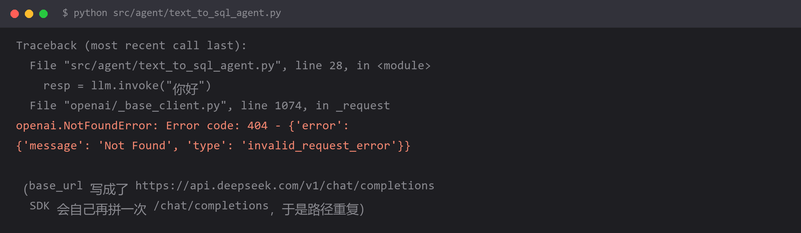

# 请求返回 `404`，但 URL 看着完全正确



## 报错

```
openai.NotFoundError: Error code: 404 -
{'error': {'message': 'Not Found', 'type': 'invalid_request_error'}}
```

你把 `base_url` 打印出来，和官方文档里的一致，但就是 404。

## 为什么

因为你多半把 `base_url` 写成了**完整的请求地址**：

```python
# 错
base_url="https://dashscope.aliyuncs.com/compatible-mode/v1/chat/completions"
```

`base_url` 的语义是「**基础**地址」，SDK 会在它后面**自己拼**上 `/chat/completions`、`/embeddings` 等具体路径。

所以你实际请求的是：

```
https://dashscope.aliyuncs.com/compatible-mode/v1/chat/completions/chat/completions
                                                                   └────── 多出来的 ──────┘
```

服务端没有这个路由，返回 404。

**注意这个坑的迷惑性**：`base_url` 里带 `/v1` 是对的（那是路径前缀的一部分），带 `/chat/completions` 才是错的。所以「看着像对」但其实是错的。

## 怎么改

**规则：`base_url` 只写到版本号为止。**

```python
# 对
base_url="https://dashscope.aliyuncs.com/compatible-mode/v1"
base_url="https://api.deepseek.com/v1"
base_url="https://open.bigmodel.cn/api/paas/v4"     # 智谱用 v4，不是 v1
```

各家正确写法：

| 提供方 | base_url |
| --- | --- |
| 阿里云百炼 | `https://dashscope.aliyuncs.com/compatible-mode/v1` |
| DeepSeek | `https://api.deepseek.com/v1` |
| 智谱 | `https://open.bigmodel.cn/api/paas/v4` |
| 硅基流动 | `https://api.siliconflow.cn/v1` |
| 本地 Ollama | `http://localhost:11434/v1` |

注意最后一行：**本地 Ollama 也要带 `/v1`**，因为 SDK 仍然按 OpenAI 协议拼路径。这是另一个高频错误——`http://localhost:11434` 会 404。

想知道 SDK 到底请求了什么地址，开 debug 日志：

```python
import logging
logging.basicConfig(level=logging.DEBUG)
```

HTTP 层的真实 URL 会打出来，一眼就能看出多拼了什么。

## 怎么预防

**记住一句：`base_url` 是「前缀」，不是「终点」。**

对照判断法：看你的 `base_url` 末尾——

- 末尾是 `/v1`、`/v4` 之类的**版本号** → 大概率对
- 末尾是 `/chat/completions`、`/completions`、`/embeddings` 这类**动词/资源名** → 一定错

另外一个通用经验：**404 和 401 的区别就是「路径」和「身份」的区别。** 404 说明身份已通过、路径没找着，所以排查范围锁定在 URL 上，跟 key 无关。

## 环境

| 组件 | 版本 |
| --- | --- |
| Python | 3.13 |
| langchain-openai | 1.x |
| OpenAI SDK | 1.x |
| 涉及提供方 | 阿里云百炼 / DeepSeek / 智谱 / Ollama |
