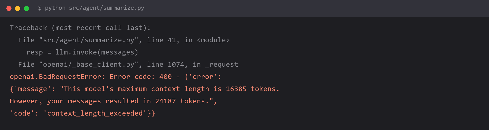

# `maximum context length is 16385 tokens` —— 上下文超长



## 报错

```
openai.BadRequestError: Error code: 400 - {'error':
{'message': "This model's maximum context length is 16385 tokens.
However, your messages resulted in 24187 tokens.",
'code': 'context_length_exceeded'}}
```

单轮问答没问题，多聊几轮或者喂一篇长文档就炸。

## 为什么

每个模型都有一个**上下文窗口上限**，指的是「输入 + 输出」加起来的 token 总数：

| 模型 | 常见窗口 |
| --- | --- |
| gpt-4o-mini | 128K |
| qwen-plus | 128K |
| 部分开源模型本地部署 | 8K / 16K / 32K |

超了就直接 400，**不是截断，是拒绝执行**。

超长的两个典型来源：

**1. 对话历史无限制增长**

```python
messages.append({"role": "user", "content": question})
messages.append({"role": "assistant", "content": answer})
# 聊到第 30 轮，前面的内容全都在，token 线性增长
```

**2. RAG 检索塞了太多文档**

```python
docs = retriever.invoke(question)          # top_k=50，每个 chunk 1000 字
context = "\n\n".join(d.page_content for d in docs)   # 5 万字，直接进 prompt
```

第二种更隐蔽，因为你在本地看不出"对话上下文有多大"——**问题出在检索结果上，不在对话里**。

## 怎么改

**方案一：滑动窗口（最简单）**

```python
MAX_TURNS = 10

def build_messages(history, new_question, max_turns=MAX_TURNS):
    recent = history[-max_turns * 2:]          # 保留最近 N 轮
    return [
        {"role": "system", "content": SYSTEM_PROMPT},
        *recent,
        {"role": "user", "content": new_question},
    ]
```

缺点是**丢掉的信息真的丢了**，用户问"你刚才提到的第三点是什么"就答不上来。

**方案二：摘要压缩（体验更好）**

```python
def compress_history(history, llm, keep_recent=4):
    if len(history) <= keep_recent * 2:
        return history

    old = history[:-keep_recent * 2]
    summary = llm.invoke(
        "把下面这段对话压缩成要点，保留所有事实性信息"
        "（人名、数字、日期、结论），去掉寒暄：\n\n"
        + "\n".join(f"{m['role']}: {m['content']}" for m in old)
    ).content

    return [
        {"role": "system", "content": f"以下是之前对话的摘要：\n{summary}"},
        *history[-keep_recent * 2:],
    ]
```

**方案三：RAG 侧控制预算**

```python
# 不要盲目加大 top_k
docs = retriever.invoke(question)

# 按 token 预算裁剪，而不是按条数
budget = 3000
used = 0
kept = []
for d in docs:
    n = count_tokens(d.page_content)
    if used + n > budget:
        break
    kept.append(d)
    used += n
```

**先重排（rerank）再截断**，效果比"多召回一些"好得多——检索 50 条然后取前 3 条，通常比直接检索 5 条更准。

## 怎么预防

**调用之前先算一遍 token，别等 API 报错。**

```python
import tiktoken

enc = tiktoken.get_encoding("cl100k_base")

def count_tokens(messages) -> int:
    total = 0
    for m in messages:
        total += len(enc.encode(m["content"]))
        total += 4          # 每条消息约 4 个 token 的结构开销
    return total

def safe_invoke(llm, messages, limit=16000, reserve=2000):
    if count_tokens(messages) > limit - reserve:
        messages = compress_history(messages, llm)
    return llm.invoke(messages)
```

关键点：

- **要给输出留位置**（上面的 `reserve`），否则输入刚好卡上限，模型没空间生成回答
- 中文大致 **1 个汉字 ≈ 1 个 token**（比英文密度高），估算时别按英文的 4 字符 1 token 算
- 本地模型（Ollama 等）用对应的 tokenizer，别拿 tiktoken 硬套

三条规则：

1. **凡是多轮对话，必须有窗口管理策略**（滑动或摘要），默认策略应该是"有"，而不是"没有"
2. **凡是 RAG，必须按 token 预算裁剪**，不能只按 top_k
3. **报 400 且消息里有 `context_length_exceeded` 或 `maximum context length`，就是这条**，直接去查 prompt 组装逻辑

## 环境

| 组件 | 版本 |
| --- | --- |
| Python | 3.13 |
| openai / langchain-openai | 1.x |
| tiktoken | 最新 |
| 复现条件 | 多轮对话不裁剪，或 RAG top_k 过大 |
