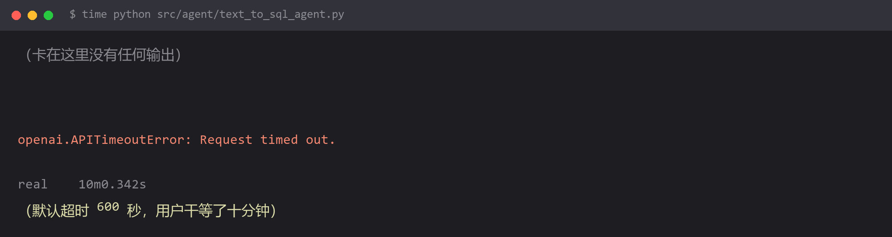

# 请求挂死十分钟 —— 默认超时时间太长



## 现象

```bash
$ time python src/agent/text_to_sql_agent.py
（光标停在这里，没有任何输出，什么都不打印）
...
Traceback (most recent call last):
  File "openai/_base_client.py", line 1074, in _request
openai.APITimeoutError: Request timed out.

real    10m0.342s
```

**脚本卡了整整十分钟才报错。** 这十分钟里程序既没死也不说话，你不知道它在等什么。

## 为什么

**OpenAI SDK 的默认超时是 600 秒（10 分钟）。**

这个默认值对"偶尔跑一次脚本"的设计取向是合理的——大模型生成长文本确实可能跑几分钟。但对交互式应用是灾难：

- 用户以为程序卡死了，杀掉重开
- 上游已经挂了，你却要等满十分钟才知道
- 你配了降级链也没用，因为降级的前提是"先失败"

**最要命的是：等你终于拿到超时异常，用户早就走了。**

而且这条链路上有三层超时，默认值完全不同，很容易互相打架：

| 层级 | 默认行为 |
| --- | --- |
| OpenAI SDK | 600 秒 |
| requests / httpx | 无超时（**永久等待**） |
| 上游网关（Nginx 等） | 常见 60 秒 |

第三层最坑：**网关 60 秒断开了，但你的客户端还在傻等 600 秒**。

## 怎么改

**第一步：给模型客户端设明确的超时**

```python
from openai import OpenAI
import httpx

client = OpenAI(
    api_key=os.getenv("DASHSCOPE_API_KEY"),
    base_url=os.getenv("DASHSCOPE_BASE_URL"),
    timeout=httpx.Timeout(
        connect=5.0,      # 连不上就 5 秒放弃（网络问题，等也没用）
        read=60.0,        # 首字节 60 秒没来就放弃
        write=10.0,
        pool=5.0,
    ),
    max_retries=2,        # 让 SDK 自己重试，别在外面手写
)
```

LangChain 里这样传：

```python
llm = ChatOpenAI(
    model="qwen-plus",
    timeout=60,           # 秒
    max_retries=2,
    request_timeout=60,   # 部分版本用的参数名
)
```

**第二步：按场景给不同超时，别用一把尺子**

| 场景 | 建议超时 | 理由 |
| --- | --- | --- |
| 意图分类 / 短问答 | 10～15 秒 | 本来就该秒回，超了就是有问题 |
| 普通对话 | 60 秒 | 给模型留生成空间 |
| 长文生成 / 报告 | 120～180 秒 | 真的需要时间 |
| **流式输出** | read 超时设 30 秒 | 有字节回来就算活着，不需要长超时 |
| Agent 多步任务 | 单步超时 × 步数上限 | 用总预算控制，别让单步无限等 |

**第三步：流式场景单独处理**

流式最容易配错：**你设的 read 超时是"两次数据之间的间隔"，不是"整段输出的总时长"。**

```python
client = OpenAI(timeout=httpx.Timeout(connect=5.0, read=30.0, write=10.0, pool=5.0))

stream = client.chat.completions.create(
    model="qwen-plus",
    messages=messages,
    stream=True,
    timeout=httpx.Timeout(connect=5.0, read=30.0, write=10.0, pool=5.0),
)
```

这样即使总输出花 5 分钟，只要每 30 秒内有 token 到达就不会超时。

**第四步：给整个任务加总预算**

```python
import signal

class TimeoutError_(Exception):
    pass

def handler(signum, frame):
    raise TimeoutError_("任务总耗时超预算")

signal.signal(signal.SIGALRM, handler)
signal.alarm(120)          # 整个任务 120 秒硬上限
try:
    result = agent.invoke({"messages": [...]})
finally:
    signal.alarm(0)
```

注意 `signal.alarm` 在 Windows 上不可用（Windows 只有 `SIGABRT` 等极少数信号），跨平台用 `concurrent.futures` 的 `timeout` 参数：

```python
from concurrent.futures import ThreadPoolExecutor, TimeoutError as FTimeout

with ThreadPoolExecutor(max_workers=1) as pool:
    future = pool.submit(agent.invoke, {"messages": [...]})
    try:
        result = future.result(timeout=120)
    except FTimeout:
        raise RuntimeError("Agent 跑了 120 秒还没结果，放弃")
```

## 怎么预防

**凡是调外部接口，都要显式设超时。** 默认值不是为了你的场景设计的。

一句话判断法：

> **如果这个请求失败，我希望多久之后知道答案？** 把这个数字填进 timeout，而不是接受库给的默认值。

还有一条容易忽略的：**超时时间要和降级链配合**。

```python
# 错：主模型超时 600 秒，备模型也超时 600 秒
#     用户最长等 1200 秒才拿到答案
# 对：主 30 秒 → 备 30 秒 → 兜底回复，总共 60 秒内一定有结果
```

**超时不是"等得久一点成功率就高一点"，而是"我的用户最多等多久"。** 想清楚这个，超时值自然就定了。

## 环境

| 组件 | 版本 |
| --- | --- |
| Python | 3.13 |
| openai | 1.x（默认 timeout 600 秒） |
| httpx | 最新 |
| 操作系统 | Windows 11（`signal.alarm` 不可用） |
