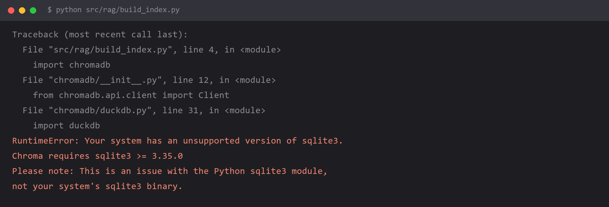

# `Chroma requires sqlite3 >= 3.35.0` —— 装了 Chroma 却 import 就炸



## 报错

```
Traceback (most recent call last):
  File "src/rag/build_index.py", line 4, in <module>
    import chromadb
  File "chromadb/__init__.py", line 12, in <module>
    from chromadb.api.client import Client
  File "chromadb/duckdb.py", line 31, in <module>
    import duckdb
RuntimeError: Your system has an unsupported version of sqlite3.
Chroma requires sqlite3 >= 3.35.0
Please note: This is an issue with the Python sqlite3 module,
not your system's sqlite3 binary.
```

注意这是在 **`import chromadb` 那一行就炸的**——你还没写任何代码。

## 为什么

报错信息最后两行是关键，**它特意强调"这是 Python 的 sqlite3 模块问题，不是你系统的 sqlite3 二进制文件问题"**：

```
Please note: This is an issue with the Python sqlite3 module,
not your system's sqlite3 binary.
```

- **系统的 sqlite3**：Windows 上一般是最新版，完全够用（`sqlite3.exe --version` 看得到 3.4x）
- **Python 内置的 sqlite3**：是编译 Python 时**静态链接**进去的一份 sqlite 副本，版本被冻结在编译那一刻

Windows 官方 Python 安装包内置的 sqlite 版本，在 3.11 之前长期停留在 **3.31 或更低**，而 Chroma 需要 **3.35+**（用到了 `RETURNING` 语法等新特性）。

所以现象就是：**系统装了全新 sqlite，但 Python 里的那个是旧的，Chroma 用 Python 那个，于是炸。**

先确认一下自己的版本：

```python
import sqlite3
print(sqlite3.sqlite_version)      # 这个才是关键
print(sqlite3.version)
```

`3.31.x` 或更低 → 就是这条坑。

## 怎么改

**方案一：用 conda 装 Python（Windows 上最省事）**

conda 的 Python 构建用了较新的 sqlite：

```bash
conda create -n rag python=3.11
conda activate rag
python -c "import sqlite3; print(sqlite3.sqlite_version)"   # 应该 >= 3.35
pip install chromadb
```

你机器上已经有 conda 的话，这条最稳。**注意一定要新建环境**，别在 base 里折腾。

**方案二：升级 Python 版本**

Python 3.12+ 的官方 Windows 安装包已经带了 3.4x 的 sqlite。升级 Python 是根治，但可能影响其他项目。

**方案三：手动替换 pysqlite3（在旧 Python 上强行解决）**

```bash
pip uninstall chromadb -y
pip install pysqlite3-binary
pip install chromadb
```

然后在**任何 import chromadb 之前**打这个补丁：

```python
# 必须放在最前面，比 import chromadb 还早
__import__("pysqlite3")
import sys
sys.modules["sqlite3"] = sys.modules.pop("pysqlite3")

import chromadb          # 现在能过了
```

原理是：Python 的 `import sqlite3` 会先看 `sys.modules` 里有没有现成的，我们把 `pysqlite3`（一个自带新版 sqlite 的轮子）顶替进去，它就用新的了。

⚠️ **这个补丁必须写在文件最开头**，任何提前 import 了 sqlite3 的库都会让补丁失效。如果你项目里到处都要 import chromadb，写个 `sitecustomize.py` 或用 `usercustomize` 更省事。

**方案四：换掉 Chroma**

如果只是想要个轻量本地向量库，这些没有 sqlite 版本问题：

| 库 | 特点 |
| --- | --- |
| FAISS | 纯 C++，无 sqlite 依赖，速度快 |
| 内存版向量库 | 几十行代码自己写，文档量小时够用 |
| Qdrant / Milvus | 走 Docker，和 Python 环境完全解耦 |

## 怎么预防

**排查链路上记住一句话：Python 里的库版本 ≠ 系统里的同名程序版本。**

这一类"版本对不上"的坑在 Python 生态里特别多：

| 你以为是 | 实际上是 |
| --- | --- |
| 系统 sqlite3 版本 | Python 静态链接的 sqlite3 版本 |
| 系统 OpenSSL | Python `ssl` 模块的 OpenSSL |
| 系统 curl | `pycurl` / `requests` 用的 libcurl |
| 系统 zlib | Python `zlib` 模块 |

遇到"我明明装了新的为什么还说版本低"，第一反应就是**去 Python 里查一次真实版本**：

```python
import sqlite3, ssl
print("sqlite:", sqlite3.sqlite_version)
print("openssl:", ssl.OPENSSL_VERSION)
```

**另一条通用建议：做 RAG / 向量库这类项目，优先用 conda 建环境。**

原因就是这类项目依赖链深、涉及大量 C 扩展，conda 的二进制分发比 pip 在 Windows 上省心得多。

## 环境

| 组件 | 版本 |
| --- | --- |
| Python | 3.11 及以下（3.12+ 通常自带新版 sqlite） |
| chromadb | 0.4.x / 0.5.x |
| sqlite3（Python 内置） | **< 3.35** 才会复现 |
| 操作系统 | Windows 11 |
