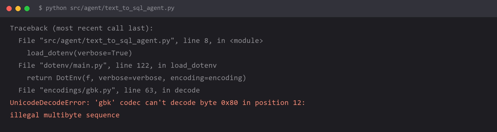

# `UnicodeDecodeError: 'gbk' codec can't decode byte` —— Windows 上读 `.env`



## 报错

```
UnicodeDecodeError: 'gbk' codec can't decode byte 0x80 in position 12:
illegal multibyte sequence
```

`.env` 文件内容看起来完全正常，但 `load_dotenv()` 或任何 `open()` 读它的时候崩了。

## 为什么

Windows 上 Python 的**默认文本编码是 `gbk`**（准确说是 `locale.getpreferredencoding()` 的返回值，中文 Windows 下就是 GBK）。

而你的 `.env` 文件是 **UTF-8** 保存的（编辑器默认行为）。里面有中文注释，比如：

```bash
# 阿里云百炼的密钥
DASHSCOPE_API_KEY=sk-xxxxx
```

`gbk` 解码器遇到 UTF-8 编码的中文字节，解不出来 → 抛 `UnicodeDecodeError`。

**关键点：没有中文就没事。** 纯 ASCII 内容在 GBK 和 UTF-8 下字节序列一致，所以「加了行中文注释」是触发条件。这也是为什么这个坑显得莫名其妙——加了注释才崩。

## 怎么改

**方案一：`.env` 注释全用英文（最快）**

```bash
# AliDashScope api key
DASHSCOPE_API_KEY=sk-xxxxx
```

对个人项目来说这最省事，`python-dotenv` 对编码的处理是「尽力而为」，不给它出难题就不会有事。

**方案二：显式指定编码（推荐）**

```python
from dotenv import load_dotenv

load_dotenv(encoding="utf-8")
```

**方案三：把整个运行环境切到 UTF-8（一劳永逸）**

```powershell
# 临时，只对当前终端会话有效
$env:PYTHONUTF8=1

# 永久（当前用户）
[System.Environment]::SetEnvironmentVariable("PYTHONUTF8", "1", "User")
```

或者直接在代码最开头（**必须在任何其他 import 之前**）：

```python
import sys
sys.stdout.reconfigure(encoding="utf-8")
```

**方案四：写文件时统一带 `encoding="utf-8"`**

```python
# 错
with open("result.md", "w") as f:
    f.write(text)

# 对
with open("result.md", "w", encoding="utf-8") as f:
    f.write(text)
```

这个坑不只是 `.env`——**任何读写文本文件的地方**在 Windows 上都有同样的风险，尤其是读写 LLM 生成的中文内容。

## 怎么预防

**在 Windows 上写 Python，凡是碰文本编码的地方都显式声明 `encoding="utf-8"`。**

把它当成一条肌肉记忆：

| 场景 | 做法 |
| --- | --- |
| `open()` 读写文件 | 永远带 `encoding="utf-8"` |
| `load_dotenv()` | 带 `encoding="utf-8"` |
| 项目级的彻底解法 | 设 `PYTHONUTF8=1` |
| `.env` 里 | 注释用英文最保险 |

顺带一个判断这个坑的快捷方式：

**只要报错信息里出现 `'gbk' codec`，就一定是编码问题，而且一定在 Windows 上。** 看到 `gbk` 两个字不用往下看栈，直接去查那行代码有没有指定 encoding。

## 环境

| 组件 | 版本 |
| --- | --- |
| Python | 3.13 |
| python-dotenv | 最新 |
| 操作系统 | **Windows 11（中文版，这一条是前提）** |
