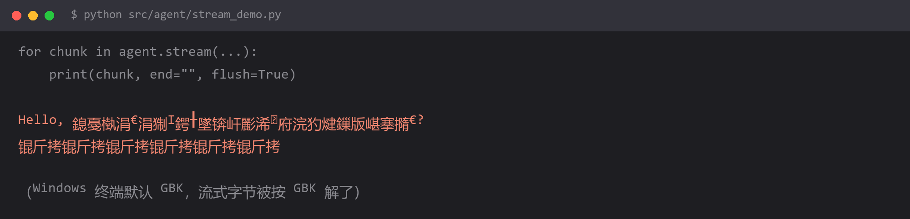

# 流式输出中文乱码



## 现象

```bash
$ python src/agent/stream_demo.py
Hello, 鎴戞槸涓€涓猘I鍔╂墜锛屽彲浠ュ府浣犳煡鏁版嵁搴撱€?
锟斤拷锟斤拷锟斤拷锟斤拷锟斤拷锟斤拷
```

英文完全正常，中文变成两种奇怪的样子：

- `鎴戞槸涓€涓猘I` —— 这是 **UTF-8 字节被按 GBK 解码**的典型外观
- `锟斤拷` —— 这是 **UTF-8 的替换符（U+FFFD）又被编码一次**的产物，俗称"锟斤拷"

**没报错，只是乱码**，所以特别容易被忽略——直到有人截图发给你。

## 为什么

流式输出是**按字节流**返回的，一个中文字符占 3 个 UTF-8 字节，很可能被切在两次 chunk 之间。

而 Python 在 Windows 上的 `print()` 用的是控制台编码（中文 Windows 下是 **GBK**）。于是：

```
模型返回:  你好          → UTF-8 字节: E4 BD A0 E5 A5 BD
print 输出:                    ↓ 按 GBK 解码
                                ↓ 一个字节对不上就换 U+FFFD
显示:      锟斤拷
```

三种成因要分开看：

| 现象 | 根因 |
| --- | --- |
| `鎴戞槸` 这类"乱但可读" | 编码解错了一次（UTF-8 当 GBK 读） |
| `锟斤拷` | 解码失败产生了替换符，替换符又被编码了一次 |
| 输出到一半断在半个字上 | 流式 chunk 把多字节字符切开了 |

**第三种最隐蔽**：你直接 `print(chunk, end="")` 逐个 chunk 打，每个 chunk 自己可能是半个字。

## 怎么改

**第一层：把标准输出切成 UTF-8**

```python
import sys

# 必须在任何输出之前执行
sys.stdout.reconfigure(encoding="utf-8", errors="replace")
sys.stderr.reconfigure(encoding="utf-8", errors="replace")
```

或者设环境变量，全局生效：

```powershell
# 当前会话
$env:PYTHONUTF8=1

# 永久（当前用户）
[System.Environment]::SetEnvironmentVariable("PYTHONUTF8", "1", "User")
```

**第二层：按字符累积，不要直接打 chunk**

这是最关键的一步。流式的本质是**字节流**，你必须自己负责"什么时候算一个完整字符"：

```python
def stream_print(stream):
    buffer = ""
    for chunk in stream:
        piece = chunk.content if hasattr(chunk, "content") else str(chunk)
        if not piece:
            continue
        buffer += piece

        # 只在缓冲区末尾是完整字符时才输出
        if not _is_partial(buffer):
            print(buffer, end="", flush=True)
            buffer = ""

    if buffer:
        print(buffer, end="", flush=True)


def _is_partial(s: str) -> bool:
    """判断末尾是否残留半个字符（UTF-8 的续字节 0b10xxxxxx）"""
    try:
        s.encode("utf-8").decode("utf-8")
        return False
    except UnicodeDecodeError:
        return True
```

大多数 SDK 已经帮你做了这层解码（返回的是 str 而不是 bytes），所以通常不会遇到半个字。**但如果你直接用 `httpx` 手撸 SSE，就必须自己处理。**

**第三层：写文件时显式指定编码**

```python
# 错：Windows 下默认 GBK，中文写进去可能出问题
with open("output.md", "w") as f:
    f.write(text)

# 对
with open("output.md", "w", encoding="utf-8") as f:
    f.write(text)
```

**第四层：终端本身也要是 UTF-8**

代码改了但还是乱码时，问题在终端：

```bash
# Git Bash / MSYS2
export LANG=zh_CN.UTF-8
export LC_ALL=zh_CN.UTF-8

# CMD（临时）
chcp 65001
```

PowerShell 用户注意：**Windows PowerShell 5.1 的默认输出编码不是 UTF-8**，建议改用 Windows Terminal + PowerShell 7，或者干脆在 Git Bash 里跑。

## 怎么预防

**在 Windows 上写 Python，把「显式 UTF-8」当成肌肉记忆。**

一份速查表：

| 位置 | 要做的 |
| --- | --- |
| 代码开头 | `sys.stdout.reconfigure(encoding="utf-8")` |
| 项目环境 | `PYTHONUTF8=1` |
| 所有 `open()` | 带 `encoding="utf-8"` |
| 所有 `.env` | 前面提过，`load_dotenv(encoding="utf-8")` |
| 终端 | `chcp 65001` / `export LANG=zh_CN.UTF-8` |

**排查顺序（从外往里）**：先确认终端是 UTF-8 → 再确认 Python 输出编码 → 最后才怀疑模型返回的内容。

判断技巧：

- **乱码但结构还在**（能看出字母和标点）→ 编码解错，改编码
- **全是 `锟斤拷`**→ 已经丢数据了，改编码的同时要重新取一次内容
- **只有流式乱码，非流式正常** → 是 print/chunk 的问题，不是模型的问题

顺带说一句：**这类乱码大多不影响程序逻辑，只影响显示。** 如果你的乱码出现在写入数据库或日志文件时，那就是真的坏了——因为存进去的就是错的。

## 环境

| 组件 | 版本 |
| --- | --- |
| Python | 3.13 |
| 操作系统 | Windows 11（中文版，默认 GBK） |
| 复现条件 | 终端或 Python 输出编码不是 UTF-8 |
