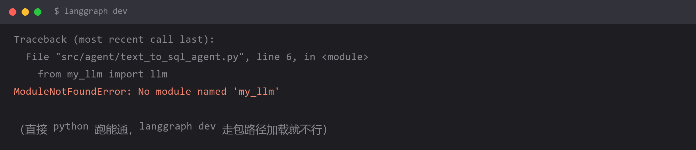

# `No module named 'my_llm'` —— langgraph 下的导入方式



## 报错

```
ModuleNotFoundError: No module named 'my_llm'
```

直接 `python src/agent/text_to_sql_agent.py` 能跑通，但用 `langgraph dev` 启动就报这个。

或者在 LangGraph Studio 里点运行时报同一个错。

## 为什么

两种运行方式的**工作目录和模块搜索路径不一样**。

```python
# 你写的（裸导入）
from my_llm import llm
```

`python src/agent/text_to_sql_agent.py` 时，Python 会把**脚本所在目录**（`src/agent/`）加入 `sys.path`，所以 `my_llm.py` 能被找到。

`langgraph dev` 不是这样跑的——它按 `langgraph.json` 的配置把项目当成一个**包**来加载：

```json
{
  "graphs": {
    "agent": "./src/agent/text_to_sql_agent.py:graph"
  },
  "python_version": "3.13",
  "dependencies": ["."]
}
```

注意 `dependencies: ["."]` —— 它会 `pip install -e .` 把项目作为包安装，然后**按包路径**导入模块。此时 `sys.path` 里是项目根目录，不是 `src/agent/`。

所以你写的 `from my_llm import llm` 找不到东西：从根目录看，`my_llm` 在 `src/agent/` 下面，正确的完整路径是 `src.agent.my_llm`。

## 怎么改

**方案一：改成完整的包路径（推荐）**

```python
# 错
from my_llm import llm
from tool.sql_tools import QuerySQLTool

# 对
from agent.my_llm import llm
from agent.tool.sql_tools import QuerySQLTool
```

注意是 `agent.xxx` 而不是 `src.agent.xxx` —— 因为 `pyproject.toml` 里已经把 `src` 声明为源码根：

```toml
[tool.setuptools]
packages = ["src/agent"]        # 或 package-dir = {"" = "src"}
```

`src` 被当作源码根之后，`src` 这一层不出现在 import 路径里，所以是 `agent.my_llm`。

**方案二：改成相对导入（在包内部互相引用时更规范）**

```python
# 在 text_to_sql_agent.py 里引用同级模块
from .my_llm import llm
from .tool.sql_tools import QuerySQLTool
```

相对导入的问题是**不能直接用 `python xx.py` 跑了**（会报 `attempted relative import with no known parent package`）。所以：

- 只用 `langgraph dev` 启动 → 相对导入最干净
- 想两种方式都能跑 → 用方案一的绝对包路径

**方案三：临时在脚本开头手动补路径（不推荐，但能救急）**

```python
import sys
from pathlib import Path
sys.path.insert(0, str(Path(__file__).resolve().parent))
```

能跑，但把「路径问题」藏在代码里，换个环境又崩。

## 怎么预防

**项目结构一旦有了 `src/` 层和 `pyproject.toml`，就统一用「包路径」导入，不用裸导入。**

三条规则：

**1. 所有 import 都从顶层包名开始写。**

```
project/
├── pyproject.toml        packages = ["src/agent"]
├── langgraph.json        dependencies = ["."]
└── src/agent/            ← 这个目录名就是顶层包名
    ├── my_llm.py
    ├── text_to_sql_agent.py
    └── tool/
        └── sql_tools.py
```

对应写法：`from agent.my_llm import llm`、`from agent.tool.sql_tools import QuerySQLTool`。

**2. 改动 import 之后，两种启动方式都要各跑一次。**

```bash
python src/agent/text_to_sql_agent.py     # 直接跑
langgraph dev                             # 框架加载
```

**两种都过才算真的对。** 只测一种，迟早会在另一种上炸。

**3. 报错里出现 `No module named` 先别改代码，先确认三件事：**

| 检查 | 命令 |
| --- | --- |
| 当前工作目录在哪 | `print(os.getcwd())` |
| Python 能看到哪些路径 | `import sys; print(sys.path)` |
| 包是否真的装了 | `pip show 你的包名` / `pip list \| grep xxx` |

大部分 `No module named` 是这三条里的一条不对，而不是代码写错了。

## 环境

| 组件 | 版本 |
| --- | --- |
| Python | 3.13 |
| langgraph CLI | 最新 |
| 项目结构 | `src/agent/` + `pyproject.toml` + `langgraph.json` |
| 操作系统 | Windows 11 |
