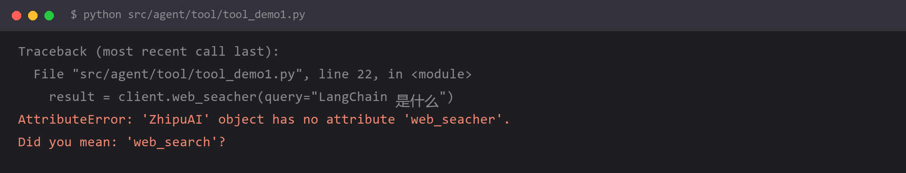

# `no attribute 'web_seacher'` —— 拼写错误的定位方法



## 报错

```
AttributeError: 'ToolDemo' object has no attribute 'web_seacher'.
Did you mean: 'web_search'?
```

或者：

```
TypeError: __init__() got an unexpected keyword argument 'seacher_engine'.
Did you mean: 'search_engine'?
```

## 为什么

纯粹是拼写错误。`search` 打成了 `seacher`（少了一个 `r` 且 `a`/`e` 换了位置），`engine` 打成了 `engine` —— 这类错误在英文非母语开发者手里非常高频。

**但这条的价值不在于「拼错了」，而在于「Python 已经把答案给你了」。**

看报错信息最后那句：

```
Did you mean: 'web_search'?
```

**Python 3.12+ 的 AttributeError 和 TypeError 会自动给出拼写建议。** 它用的是编辑距离算法，把最接近的合法名字列出来。所以报错信息最后那句 `Did you mean` 就是你想要的那个正确拼写。

如果你没注意过这个特性，会觉得报错信息很长、没什么用——实际上**最后一行才是真正的答案**。

## 怎么改

**三步定位法：**

**第一步：读报错最后一行。**

```
Did you mean: 'web_search'?
```

直接复制这个正确名字用。

**第二步：全文搜索错词，一处都别漏。**

```
Ctrl+Shift+F  →  搜 "seacher"
```

为什么要全文搜而不是只改报错那一行？因为**同一个拼写错误往往在多个地方重复**——定义处、调用处、配置处。只改一处，下次运行会在下一个地方报错，来回好几轮。

**第三步：如果拼错的是字符串而不是标识符，`Did you mean` 帮不了你。**

```python
tool = SearchTool(seacher_engine="google")     # TypeError，能给出建议
config = {"seacher": True}                     # 不报错，静默失效
```

字典的 key 拼错**不会报错**，只是取值时拿到 `None`。这种情况要靠检查必填项：

```python
def build(searcher_id: str, engine: str, top_k: int = 5):
    ...
```

**用函数签名代替裸字典**——参数名拼错时 Python 会立刻报 `unexpected keyword argument`，还能给拼写建议。

## 怎么预防

**看到 `AttributeError` 或 `TypeError` 里带 `Did you mean`，直接去看那一行，不要从报错第一行开始读。**

再补三条实用习惯：

**1. 报错信息要读完，不要只看第一行。**

栈很长的时候，人容易只看顶部那行就下结论。但 Python 的报错**最有价值的通常是最后 3 行**：

| 位置 | 内容 | 价值 |
| --- | --- | --- |
| 第一行 | 异常类型 + 消息 | 定性：什么错 |
| 中间 | 调用栈 | 定位：哪一行、怎么走到这的 |
| **最后一行** | **`Did you mean` / `got an unexpected`** | **答案：怎么改** |

**2. 让 IDE 帮你拼。**

开启 Pylance / PyCharm 的未解析属性检查。拼错时编辑器会直接画波浪线，不用等运行。

**3. 名字里的词按「整词记忆」，不要手打。**

`search` / `engine` / `searcher` / `schedule` 这几个是重灾区。复制粘贴比手打安全。

**4. 报错里出现 `Did you mean`，说明 Python 版本 ≥ 3.12。** 如果你在别人的机器（旧 Python）上跑同样的代码，报错信息会缺这一段——所以别依赖它，它只是加速器。

## 环境

| 组件 | 版本 |
| --- | --- |
| Python | 3.13（`Did you mean` 需要 3.12+） |
| 复现场景 | 手写 LangChain 工具类 |
