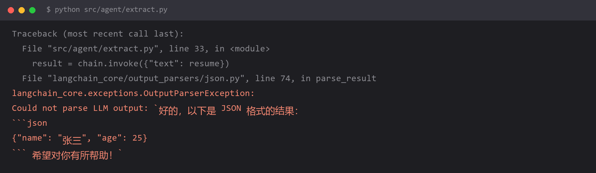

# `OutputParserException: Could not parse LLM output` —— 结构化输出解析失败



## 报错

```
langchain_core.exceptions.OutputParserException:
Could not parse LLM output: `好的，以下是 JSON 格式的结果：
```json
{"name": "张三", "age": 25}
``` 希望对你有所帮助！`
```

**看出来了吗？JSON 本身完全正确，但模型在外面包了客套话和 Markdown 代码块。**

## 为什么

你要求模型输出 JSON，模型的"帮助性"人格又让它加上了开场白和结尾语——这是模型行为，不是 bug。

```python
from langchain_core.output_parsers import JsonOutputParser

chain = prompt | llm | JsonOutputParser()
chain.invoke({...})
# JsonOutputParser 去找第一个 { 到最后一个 }，
# 但 ```json 这些字符还在，json.loads 直接抛异常
```

常见的三种"多余包装"：

| 模型输出 | 解析结果 |
| --- | --- |
| ```` ```json {...} ``` ```` | 代码块标记干扰 |
| `以下是结果：{...} 希望有帮助` | 前后有自然语言 |
| `{'name': '张三'}` | **单引号**，不是合法 JSON |

第三种最气人：看起来一模一样，但 JSON 规范要求双引号。

**根本问题**：你在用"自然语言提示"约束"随机性输出"，然后指望结果 100% 可解析。**这个假设本身就是错的。**

## 怎么改

**方案一：用模型厂商的结构化输出能力（首选）**

不要靠提示词，用 API 层面的保证：

```python
from pydantic import BaseModel, Field

class Person(BaseModel):
    name: str = Field(description="姓名")
    age: int = Field(description="年龄")

# OpenAI
llm = ChatOpenAI(model="gpt-4o-mini")
structured = llm.with_structured_output(Person)
result = structured.invoke("张三今年 25 岁")
print(result.name, result.age)      # 一定是 Person 实例，不是字符串
```

底层走的是 `response_format` / function calling，**由 API 保证输出合法**，不靠模型自觉。

**方案二：JSON 模式（约束输出格式）**

```python
llm = ChatOpenAI(model="gpt-4o-mini", model_kwargs={
    "response_format": {"type": "json_object"}
})
```

⚠️ **用之前先确认模型支持**。不少国内模型和本地开源模型不支持这个参数，会直接报错或静默忽略。而且它只保证"是合法 JSON"，不保证"字段符合你的模型"。

**方案三：用能容错的 parser + 自己兜底**

```python
import json, re
from langchain_core.output_parsers import JsonOutputParser
from langchain_core.exceptions import OutputParserException

def robust_parse(text: str, model_cls):
    """从一段任意文本里捞出 JSON"""
    # 1) 先剥 Markdown 代码块
    text = re.sub(r"```(?:json)?\s*", "", text).strip("` \n")

    # 2) 找最外层的 {...}
    start, end = text.find("{"), text.rfind("}")
    if start == -1 or end == -1:
        raise ValueError(f"完全没找到 JSON: {text[:200]}")

    obj = json.loads(text[start:end + 1])
    return model_cls(**obj)


# 3) 用 fallback 链兜住
chain = prompt | llm | RunnableLambda(lambda m: robust_parse(m.content, Person))
```

**方案四：加一个"修复重试"环节**

解析失败时，把报错丢回给模型让它自己修：

```python
from langchain_core.runnables import RunnableLambda

def parse_with_repair(text, model_cls, llm, max_tries=2):
    last_err = None
    for _ in range(max_tries):
        try:
            return robust_parse(text, model_cls)
        except Exception as e:
            last_err = e
            fixed = llm.invoke(
                f"下面这段文本本该是 JSON，但解析失败了。\n"
                f"错误：{e}\n"
                f"原文：{text}\n\n"
                f"只输出修正后的 JSON，不要任何解释和代码块标记。"
            ).content
            text = fixed
    raise last_err
```

这次提示词里明确说"不要代码块标记"，命中率会高很多——**因为你现在是在纠错，不是在凭空生成。**

## 怎么预防

**第一原则：能用 API 层的结构化输出，就不要用提示词约束。**

```
可靠性排序（从高到低）：
  1. with_structured_output（function calling / response_format）
  2. JSON mode + Pydantic 校验
  3. 提示词约束 + 容错解析 + 重试
  4. 只用提示词说"请输出 JSON"     ← 就是在赌
```

**第二：解析失败必须能被捕获，不能让它炸穿整个流程。**

```python
# 错：解析失败 = 整个任务失败
result = chain.invoke(x)

# 对：解析失败 = 走兜底路径
try:
    result = chain.invoke(x)
except OutputParserException:
    result = fallback_value      # 或者转人工、或者重试
```

在批量任务里（跑 1000 条），**只要有一条解析失败，整个循环就断了**——这是最常见的翻车方式。

**第三：提示词里明确禁止包装。**

```
# 光说"输出 JSON"不够，要具体：
只输出一个 JSON 对象。不要 Markdown 代码块，不要 ```json 标记，
不要在 JSON 前后添加任何说明文字。第一个字符必须是 {，最后一个必须是 }。
```

**第四：模型越强，解析越稳。** 小模型（7B 以下）做结构化输出时的失败率明显更高。如果这条坑反复出现，先考虑换个模型，而不是把 parser 写得越来越复杂。

## 环境

| 组件 | 版本 |
| --- | --- |
| Python | 3.13 |
| langchain-core | 1.x |
| pydantic | v2 |
| 复现条件 | 用提示词约束 JSON 输出，且没做容错解析 |
