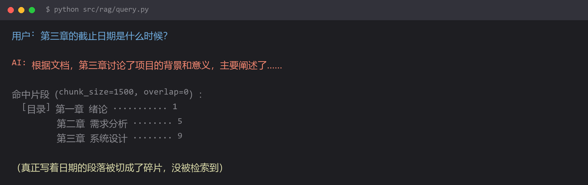

# RAG 答非所问 —— 切片把答案切碎了



## 现象

```
用户: 第三章的截止日期是什么时候？

AI: 根据文档，第三章讨论了项目的背景和意义，主要阐述了……
```

**没有报错，没有异常，只是答案和问题没关系。**

你去查检索结果，发现命中的是文档的**目录页**：

```
命中片段（chunk_size=1500, overlap=0）：
  [目录] 第一章 绪论 ........... 1
         第二章 需求分析 ........ 5
         第三章 系统设计 ........ 9
```

而真正写着"第三章截止日期 2026-10-15"的那一段，**根本没被检索到**。

## 为什么

**RAG 的效果上限，由切片质量决定。** 模型只能看到检索出来的那几段文字，检索错了，再强的模型也答不对。

常见的四种切片错误：

| 错误 | 后果 |
| --- | --- |
| **chunk_size 太大**（1500+） | 一段里混了好几个主题，向量被"平均"了，跟谁都不像 |
| **chunk_size 太小**（100 以下） | 一句话被切成三片，语义不完整 |
| **overlap=0** | 关键句子正好横跨两片边界，两边都不完整 |
| **按固定长度硬切** | 把表格、列表、代码块从中间截断 |

上面那个例子里，**"第三章 ... 截止日期 2026-10-15" 很可能本来就横跨两个 chunk 的边界**，被切成：

- chunk A：`第三章 系统设计，本章需要提交…`
- chunk B：`…截止日期为 2026-10-15。`

chunk B 里没有"第三章"这个关键词，所以用"第三章 截止日期"去检索时，它的相似度反而不如目录页高——**目录页完整包含了"第三章"和"截止日期"附近的词**。

**这就是最反直觉的地方：内容正确的片段，可能因为切片方式而检索不到。**

## 怎么改

**第一层：按语义边界切，不要按字符数硬切**

```python
from langchain_text_splitters import RecursiveCharacterTextSplitter

splitter = RecursiveCharacterTextSplitter(
    chunk_size=500,
    chunk_overlap=80,                 # 一定要留重叠
    length_function=len,
    separators=[
        "\n## ",       # 先按二级标题
        "\n### ",
        "\n\n",        # 再按段落
        "\n",
        "。",           # 中文句号
        "！", "？",
        "；",
        "，",
        "",            # 最后才按字符
    ],
)
```

`RecursiveCharacterTextSplitter` 会**依次尝试**这些分隔符：先用能切出的最大语义单元，切不动了才降级到更细的粒度。这样段落一般不会被从中间截断。

**中文文档三个要点：**

1. **分隔符要带中文标点**（`。！？；`）。默认的分隔符只有英文标点，对中文基本等于按字符硬切
2. **Markdown 文档把标题层级放到最前面**，标题本身是极强的语义边界
3. **表格和代码块要单独处理**，别混在正文里切

**第二层：加 overlap**

```python
chunk_overlap=80      # 约为 chunk_size 的 10%~20%
```

重叠的作用就是**兜住跨界信息**：上面那个例子里，如果 overlap 是 80，chunk B 的开头会带上 chunk A 的结尾，`第三章` 这个关键词就还在。

代价是存储和检索量增加（重复内容），但**对召回率的提升远大于成本**。这是性价比最高的一行改动。

**第三层：让每个 chunk 自带上下文**

这是解决"片段孤立"的根本办法——**在切分时把所属的标题层级粘到每段前面**：

```python
from langchain_text_splitters import MarkdownHeaderTextSplitter

headers_to_split_on = [
    ("#", "h1"),
    ("##", "h2"),
    ("###", "h3"),
]

md_splitter = MarkdownHeaderTextSplitter(headers_to_split_on=headers_to_split_on)
chunks = md_splitter.split_text(markdown_text)

# 每个 chunk 的 metadata 里就带上了所属标题
for c in chunks:
    prefix = " > ".join(filter(None, [
        c.metadata.get("h1"), c.metadata.get("h2"), c.metadata.get("h3")
    ]))
    c.page_content = f"【{prefix}】\n{c.page_content}"
```

这样 chunk B 变成了：

```
【第三章 系统设计】
…截止日期为 2026-10-15。
```

**"第三章"这个关键词回来了，检索立刻就能命中。**

**第四层：加 rerank（效果提升最明显的一步）**

```python
from sentence_transformers import CrossEncoder

reranker = CrossEncoder("BAAI/bge-reranker-v2-m3")

def retrieve_with_rerank(query, k_recall=20, k_final=5):
    # 1) 先用向量检索多召回一些（宁滥勿缺）
    candidates = vector_store.similarity_search(query, k=k_recall)

    # 2) 用 cross-encoder 精排
    pairs = [(query, d.page_content) for d in candidates]
    scores = reranker.predict(pairs)

    # 3) 取前 k 个
    ranked = sorted(zip(candidates, scores), key=lambda x: -x[1])
    return [d for d, _ in ranked[:k_final]]
```

**为什么有效**：向量检索是"双塔"结构——查询和文档**分别**编码，比较的是两个独立向量的距离，精度天然有限。Cross-encoder 把查询和文档**拼在一起**过一次模型，精度高得多。

**代价是慢**。所以用"粗排召回 20 条 → 精排取 5 条"的两段式，而不是直接对全库精排。

## 怎么预防

**RAG 调优的正确顺序（按性价比排序）：**

```
1. 先看检索出来的原始片段 —— 大部分问题在这里就能发现
2. 调 chunk_size / overlap
3. 加标题上下文
4. 加 rerank
5. 最后才考虑换 embedding 模型或换 LLM
```

**很多人一上来就调模型，其实前三步就能解决 80% 的问题。**

三条实践建议：

**1. 永远先打印检索结果，再看模型回答。**

```python
docs = retriever.invoke(question)
print("=== 检索到", len(docs), "段 ===")
for i, d in enumerate(docs):
    print(f"--- [{i}] score={d.metadata.get('score', 'n/a')} ---")
    print(d.page_content[:200])
```

**答案错了，九成是检索错了，不是模型错了。** 不看检索结果就直接改提示词，是在瞎猜。

**2. 手工做一个小评测集。**

准备 20 条"问题 → 应该命中的文档段落"的对应关系，每次改切片策略就跑一遍，看命中率。

凭感觉调参是调不出来的——**你觉得变好了，可能只是恰好试的那个问题变好了。**

**3. chunk_size 按文档类型定，不要一个值用到底。**

| 文档类型 | 建议 chunk_size |
| --- | --- |
| 技术文档 / 说明书 | 300～500 |
| 论文 / 长文 | 600～1000 |
| FAQ / 问答对 | 一问一答为一片 |
| 代码文件 | 按函数/类切 |
| 表格 | 不要切，整表保留 |

**判断技巧**：如果一个 chunk 里出现了两个不相干的话题，说明切大了；如果一段话读起来像断了半截，说明切小了。

## 环境

| 组件 | 版本 |
| --- | --- |
| Python | 3.13 |
| langchain-text-splitters | 最新 |
| sentence-transformers | 最新（用于 rerank） |
| 复现条件 | 按固定长度切分且 overlap=0 |
