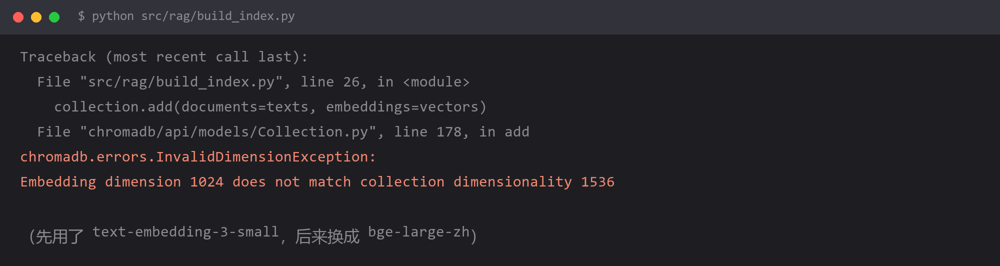

# `Embedding dimension 1024 does not match collection dimensionality 1536` —— 向量维度不匹配



## 报错

```
chromadb.errors.InvalidDimensionException:
Embedding dimension 1024 does not match collection dimensionality 1536
```

**索引已经建好了，现在往里加数据就炸。** 或者反过来：新写入正常，但查询时报同样的错。

## 为什么

向量库创建 collection 时，会**把第一个写入的向量维度固化下来**，之后所有向量必须完全一致。

你的情况通常是**中途换了 embedding 模型**：

| 阶段 | 用的模型 | 维度 |
| --- | --- | --- |
| 建索引时 | `text-embedding-3-small` | 1536 |
| 现在 | `bge-large-zh-v1.5` | **1024** |

维度不同 = 向量空间不同 = **无法比较**。128 维和 1024 维的向量算余弦相似度，数学上就说不通。

**关键点：旧数据来不及换，新数据也进不去。**

维度差异很常见，换模型时不一定想得到：

| 模型 | 维度 |
| --- | --- |
| text-embedding-3-small | 1536 |
| text-embedding-3-large | 3072 |
| text-embedding-ada-002 | 1536 |
| bge-large-zh-v1.5 | 1024 |
| bge-m3 | 1024 |
| m3e-base | 768 |
| text2vec-base-chinese | 768 |

**768 / 1024 / 1536 / 3072 四种维度混在一起，是踩坑重灾区。**

## 怎么改

**方案一：重建索引（唯一正确的做法）**

维度不一致时**没有"转换"的捷径**——不同模型的向量空间没有线性对应关系，不能插值也不能投影。

```python
import chromadb
from chromadb.utils.embedding_functions import SentenceTransformerEmbeddingFunction

client = chromadb.PersistentClient(path="./chroma_db")

# 1) 删掉旧 collection
try:
    client.delete_collection("docs")
except Exception:
    pass

# 2) 用新模型重建
ef = SentenceTransformerEmbeddingFunction(model_name="BAAI/bge-large-zh-v1.5")
col = client.create_collection(name="docs", embedding_function=ef)

# 3) 重新灌入全部原始文档（注意：是原始文本，不是旧向量）
col.add(
    documents=chunks,
    ids=[f"doc{i}" for i in range(len(chunks))],
)
print("当前维度：", col.count(), "条；", len(col.peek()["embeddings"][0]), "维")
```

**代价是调用 embedding 模型的费用和时间**，所以模型选定后再大规模灌数据，别一边试一边灌。

**方案二：先确认到底是哪一边的维度不对**

别急着删，先查清楚：

```python
col = client.get_collection("docs")
sample = col.peek(limit=1)
if sample["embeddings"] is not None and len(sample["embeddings"]) > 0:
    print("collection 里的维度：", len(sample["embeddings"][0]))

# 再看当前 embedding function 输出多少维
v = ef(["测试文本"])
print("当前模型的维度：", len(v[0]))
```

如果两边一样却还报错，那就是**代码里有两个不同的 embedding 实例**（比如一个传给了 collection，另一个在别处独立创建）。

**方案三：多模型共存时就分 collection**

```python
# 一个模型一个 collection，命名带上模型名
col_bge = client.get_or_create_collection("docs_bge_large_zh")

# 绝对不要往同一个 collection 里塞不同模型的向量
```

**方案四：把维度写进配置，启动时校验**

```python
EXPECTED_DIM = 1024

def get_collection(client, name="docs"):
    col = client.get_or_create_collection(name=name)
    if col.count() > 0:
        dim = len(col.peek(limit=1)["embeddings"][0])
        if dim != EXPECTED_DIM:
            raise RuntimeError(
                f"collection '{name}' 的向量维度是 {dim}，"
                f"但配置期望 {EXPECTED_DIM}。"
                f"要么改配置，要么删掉 collection 重建："
                f"client.delete_collection('{name}')"
            )
    return col
```

**失败要发生在启动时，而不是跑了半小时、灌到第 8000 条的时候。**

## 怎么预防

**核心规则：embedding 模型一旦定了，就不要换；真要换，就重建全量索引。**

把这条写进项目文档，比记在脑子里可靠。

三条实践建议：

**1. 把模型名和维度一起写进配置，并且显式声明维度。**

```python
EMBEDDING_CONFIG = {
    "model": "BAAI/bge-large-zh-v1.5",
    "dim": 1024,          # 显式写出来，方便校验和自查
}
```

**2. 索引元数据里记录生成时的模型信息。**

```python
col.metadata = {
    "embedding_model": "BAAI/bge-large-zh-v1.5",
    "dim": 1024,
    "built_at": "2026-09-28",
}
```

将来排查时，一眼就能看出"这个索引是用哪个模型建的"，不用去翻提交历史。

**3. 测试环境用和生产相同的模型。**

测试用 `text-embedding-3-small`（便宜）、生产用 `bge-large-zh`（中文效果好），是最典型的翻车配置——因为**本地全绿，上线就炸**。

**判断这个坑最快的方法**：

报错信息里出现 `dimension` + 两个不同的数字，就是它。**不用看别的，直接去查你换过 embedding 模型没有。**

## 环境

| 组件 | 版本 |
| --- | --- |
| Python | 3.13 |
| chromadb | 0.5.x |
| 复现条件 | 同一个 collection 混用了不同 embedding 模型 |
